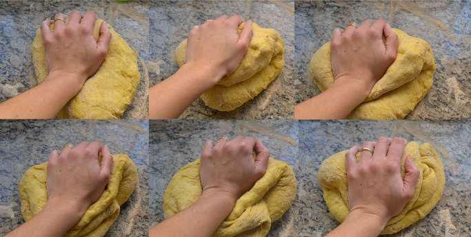
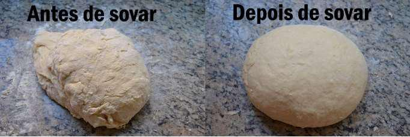
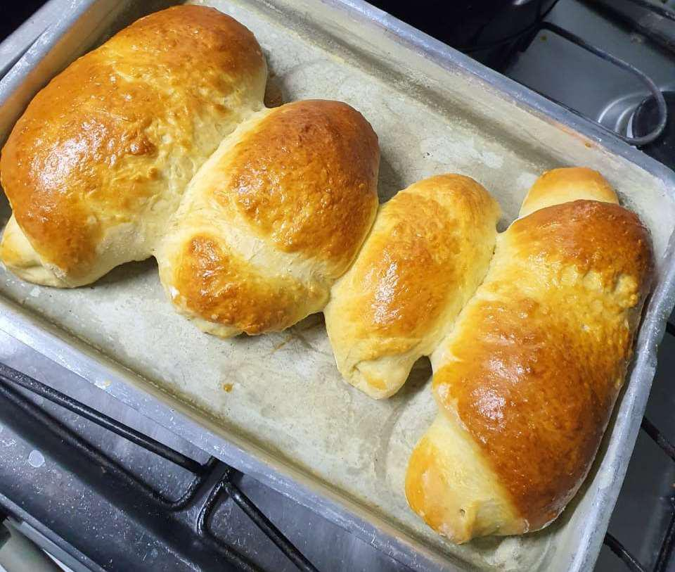

# Pão de Leite

## Ingredientes

-   3 tabletes de 15g de fermento biológico fresco
-   250ml de leite
-   3 ovos
-   4 colheres de sopa de manteiga
-   4 colheres de sopa de açúcar
-   1 ^1^/~2~ colheres de chá de sal
-   2 xícaras (aproximado) de farinha

## Preparo

Aquecer o leite até ficar morno (não pode ferver) e misturar o fermento até que este se dissolva completamente. 

> **Dica:** colocar o dedo dentro do leite para medir a temperatura; aquecer até que seja possível sentir o calor sem que a temperatura esteja desconfortável para o dedo.

Retirar a membrana da gema e bater os ovos. Misturar ao leite com o fermento os ovos e a manteiga.

Adicionar o açúcar e o sal à mistura. Adicionar a farinha aos poucos até que a massa esteja soltando da mão, mexendo como ilustrado na Figura 1.

|  |
| :--------------------------------------: |
|   **Figura 1:** Como sovar uma massa.    |

> **Dica:** é interessante tentar rasgar a massa para verificar se ela está elástica (bom) ao invés de farelenta (ruim). 

Quanto atingir o ponto (mostrado na Figura 2) deixar a massa crescer até que atinja o dobro do volume.

|  |
| :-------------------------------------------: |
|   **Figura 2:** Ponto da massa após sovar.    |

Pré-aquecer o forno a 220 ^o^C por aproximadamente 20 minutos antes de assar os pães. Moldar a massa no formato desejado e colocar em uma forma untada: deixar crescer novamente até atingir o dobro do volume. Enquanto crescem os pães, passar o ovo mexido com um pincel sobre eles (fazer isso até o momento de colocá-los no forno — isso faz com que fiquem bem dourados).

Deixar os pães no forno até que a casca atinja um tom como o da Figura 3 (ou um pouco mais escuro).

|  |
| :---------------------------------------------------: |
|   **Figura 3:** Ponto para retirar o pão do forno.    |

Após retirar do forno, esperar esfriar por 10 minutos antes de cortar.